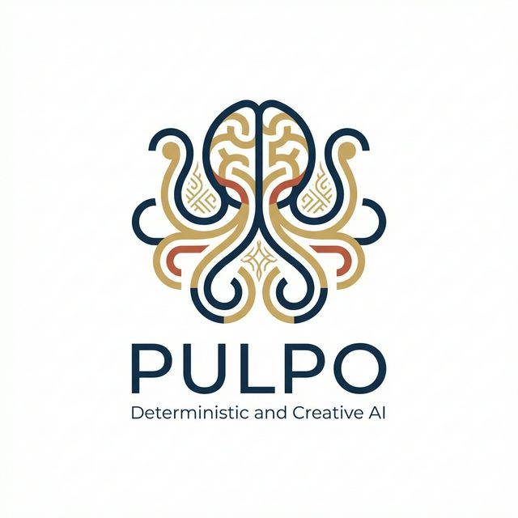

# Pulpo — Brand Identity

**Tagline:** *Deterministic and Creative AI*

---

## Name

**Pulpo** — Spanish for *octopus*. The name was chosen as a powerful metaphor for the system's architecture: an ontology-driven engine whose tentacles reach into every layer of a software project, connecting knowledge nodes just as an octopus connects its environment through its remarkable nervous system.

## Logo Concept

The logo is a geometric abstraction of an octopus fused with a brain, communicating three core ideas simultaneously:

### 1. The Octopus — Decentralized Intelligence
An octopus has nine brains: one central brain and one in each of its eight arms. Each arm can act independently, sensing and reacting to its environment without waiting for a central command. This mirrors **Pulpo's** architecture — a central ontology engine that empowers autonomous, intelligent agents across different domains (CLI, TUI, visualizer) while maintaining coherent, unified knowledge.

### 2. The Brain — Deterministic & Creative AI
The upper portion of the logo subtly forms a brain shape, representing the AI's dual nature:
- **Deterministic**: Ontology-driven reasoning that is predictable, reproducible, and auditable.
- **Creative**: The capacity to generate, explore, and synthesize novel solutions within a structured knowledge graph.

### 3. The Colombian Touch
The logo incorporates design elements inspired by **Pre-Columbian Colombian goldwork**, specifically the geometric patterns of the **Quimbaya** and **Zenú** cultures:
- **Gold tones** reference the legendary *El Dorado* and the masterful metallurgy of ancient Colombian civilizations.
- **Deep navy blue** evokes the Pacific and Caribbean coasts of Colombia.
- **Terracotta red** is a subtle nod to Colombian earth and the warmth of its culture.
- The **interlocking geometric patterns** within the tentacles are inspired by the abstract, symmetrical motifs found in Pre-Columbian gold artifacts displayed at the *Museo del Oro* in Bogotá.

## Color Palette

| Role        | Color              | Hex       | Usage                                    |
|-------------|--------------------|-----------|------------------------------------------|
| Primary     | Deep Navy          | `#1B2A4A` | Typography, primary UI elements          |
| Secondary   | Quimbaya Gold      | `#C8A45C` | Accents, highlights, logo fills          |
| Accent      | Terracotta Red     | `#B85C38` | Call-to-action, creative emphasis        |
| Background  | Clean White        | `#FAFAFA` | App backgrounds, canvas                  |
| Surface     | Warm Gray          | `#F0ECE3` | Cards, panels, secondary surfaces        |
| Text        | Charcoal           | `#2D2D2D` | Body text                                |

## Typography

- **Headings**: Inter (700 weight) — geometric, modern, highly legible
- **Body**: Inter (400 weight) — clean, neutral, professional
- **Monospace**: JetBrains Mono — for code and terminal output

## Values Communicated

1. **Intelligence** — The brain-octopus fusion
2. **Connectivity** — Tentacles linking knowledge nodes
3. **Heritage** — Colombian cultural roots expressed through pattern and color
4. **Precision** — Clean geometry, deterministic reliability
5. **Creativity** — Organic curves within structured forms
