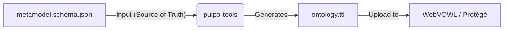

# How to Visualize the Ontology

The Infinite Coding Loop uses a strict **JSON Schema** (`metamodel.schema.json`) as the source of truth for its execution graph. However, JSON Schema is not natively visualizable as a graph.

To solve this, we automatically generate a standard **OWL/Turtle** ontology file (`ontology.ttl`) which can be opened in any standard semantic web visualization tool.

## Prerequisite: Generate the Ontology

Before visualizing, you must generate the latest `.ttl` file from the schema source.

1.  Open your terminal in the project root.
2.  Run the generation command:
    ```bash
    make ontology
    ```
    *This runs `cargo run -p pulpo-tools -- convert` and verifies the output.*

3.  Locate the output file:
    *   `ontology/ontology.ttl`

## Option 1: WebVOWL (Recommended for Quick Viewing)

[WebVOWL](http://vowl.visualdataweb.org/webvowl.html) provides an interactive, force-directed graph visualization in your browser.

1.  Open [WebVOWL](http://vowl.visualdataweb.org/webvowl.html).
2.  Look for the **"Ontology"** menu at the bottom of the sidebar.
3.  Click **"Upload ontology"**.
4.  Select your local `ontology/ontology.ttl` file.
5.  **Interact:** You can now drag nodes, zoom in/out, and click on edges (relations) to see how the Agentic Graph is structured.

## Option 2: Protégé (Recommended for Deep Inspection)

[Protégé](https://protege.stanford.edu/) is a professional ontology editor.

1.  Download and install Protégé.
2.  Go to **File -> Open**.
3.  Select `ontology/ontology.ttl`.
4.  Navigate to the **"Ontograf"** or **"OWLViz"** tab to see the hierarchy and relationships.

## Data Flow


